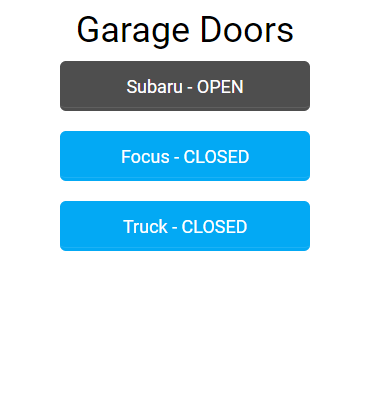

# ESP8226_Garage_Controller

This is an ESP8266 based controller for actuating your garage doors using your current garage
door openers and is configurable for up to 3 doors.

Integrates with any Home Automation system that supports REST API's

Samples of the inteface and Bill of Materials can be found in the "info" folder.

The controller uses the following library: https://github.com/Lymkin/myWebServerAsync

You can use a NodeMCU or my custom board that you can order from DirtyPCB's at:
https://dirtypcbs.com/store/designer/details/10941/6271/esp8266-garage-controller

A ProtoPak of 10 is $11.95 at the time I posted this.



**Home Assistant Integration Example:**

```
#####################################
# Garage Doors
#####################################
  # Door1
  - platform: command_line
    covers:
      garage_door:
        command_open: '/usr/bin/curl -X PUT -d OPEN http://172.16.1.10/api/door1/state/open'
        command_close: '/usr/bin/curl -X PUT -d CLOSED http://172.16.1.10/api/door1/state/close'
        friendly_name: "Crosstrek Garage Door"
        command_state: '/usr/bin/curl http://172.16.1.10/api/door1/state'
        value_template: >
          
          100
          
          0
          

  # Door2
  - platform: command_line
    covers:
      garage_door:
        command_open: '/usr/bin/curl -X PUT -d OPEN http://172.16.1.10/api/door2/state/open'
        command_close: '/usr/bin/curl -X PUT -d CLOSED http://172.16.1.10/api/door2/state/close'
        friendly_name: "Focus Garage Door"
        command_state: '/usr/bin/curl http://172.16.1.10/api/door2/state'
        value_template: >
          
          100
          
          0
          
  
  # Door 3
  - platform: command_line
    covers:
      garage_door:
        command_open: '/usr/bin/curl -X PUT -d OPEN http://172.16.1.10/api/door3/state/open'
        command_close: '/usr/bin/curl -X PUT -d CLOSED http://172.16.1.10/api/door3/state/close'
        friendly_name: "Truck Garage Door"
        command_state: '/usr/bin/curl http://172.16.1.10/api/door3/state'
        value_template: >
          
          100
          
          0
          
```
**NOTE:** See DoorSetup.png from the "info" folder to see how the controller sends updates to HA if a door was manually actuated.

**Initial Setup:**

1. Once you have flashed the ESP8266, restart the ESP.
1. Since there is no WiFi setup, the ESP will start in AP mode.
    1. Use your phone or tablet to connect to your ESP's WiFi SSID. (Something like "myespxxx")
    1. If your device works with captive DNS you can web browse to any url and get redirected to the ESP.
    1. If captive DNS does not work browse to http://192.168.4.1
    1. You should now see the wifi setup page. Enter your device name, your WiFi network SSID and password
       at a minimum and "save" the configuration.
       **Note:** To enable authentication to the web interface, you must enter a password for the admin user. (I recommend leaving the password blank till you're up and running, but don't forget to add it.)
    1. Restart your ESP.
1. Now your ESP should be connected to your WiFi network.
    1. Browse to http://device_name.local  (device_name will be what you configured above)
    1. The integrated filebrowser should now show up.  If not browse to http://device_name.local/browse.
    1. Drag and Drop each of the files in the "html" folder to add them to the SPIFFS file system.
    1. You should already see some files that are auto added by the myWebServerAsync library.
    1. Restart your ESP.
1. Browse to http://device_name.local/doorsetup.html
    1. Configure your doors as appropriate. See DoorSetup.png from the "info" folder for an example.
    1. Save the config.
    1. Restart ESP.

